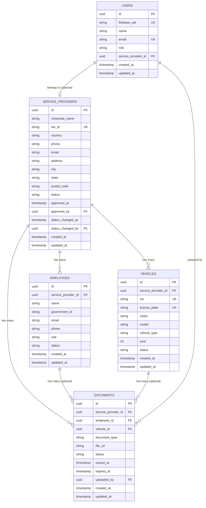

# Database Model

This document describes the database schema, entity relationships, constraints, and modeling decisions for the Service Provider API.

## Overview

The system uses PostgreSQL as its relational database and Sequelize as the ORM. All tables use `snake_case` naming. Primary keys are UUIDs generated by the application layer (`gen_random_uuid()` would also work at the database level). Timestamps `created_at` and `updated_at` are present on every table.

The schema is intentionally compact: five tables, one composite uniqueness constraint, one polymorphic check constraint, and a handful of indexes. The design prioritizes clarity and integrity over normalization extremes.

## Entity Relationship Diagram



## Tables

### `users`

Holds authenticated user accounts. The application does not store passwords; authentication is delegated to Firebase Authentication. The `firebase_uid` column links the local user record to the Firebase identity.

| Column                 | Type        | Constraints                                  |
| ---------------------- | ----------- | -------------------------------------------- |
| `id`                   | UUID        | PK                                           |
| `firebase_uid`         | VARCHAR     | UNIQUE, NOT NULL                             |
| `name`                 | VARCHAR     | NOT NULL                                     |
| `email`                | VARCHAR     | UNIQUE, NOT NULL                             |
| `role`                 | VARCHAR     | NOT NULL, CHECK IN (`admin`, `provider`)     |
| `service_provider_id`  | UUID        | FK to `service_providers(id)`, NULLABLE      |
| `created_at`           | TIMESTAMPTZ | NOT NULL                                     |
| `updated_at`           | TIMESTAMPTZ | NOT NULL                                     |

A user with `role = 'provider'` must have a non-null `service_provider_id`. A user with `role = 'admin'` must have a null `service_provider_id`. This invariant is enforced by application logic and a CHECK constraint.

### `service_providers`

Holds provider company records.

| Column                 | Type        | Constraints                                                                        |
| ---------------------- | ----------- | ---------------------------------------------------------------------------------- |
| `id`                   | UUID        | PK                                                                                 |
| `corporate_name`       | VARCHAR     | NOT NULL                                                                           |
| `tax_id`               | VARCHAR     | UNIQUE, NOT NULL                                                                   |
| `country`              | CHAR(2)     | NOT NULL, CHECK IN (`BR`,`US`,`DE`,`GB`,`FR`)                                      |
| `phone`                | VARCHAR     | NOT NULL                                                                           |
| `email`                | VARCHAR     | NOT NULL                                                                           |
| `address`              | VARCHAR     | NOT NULL                                                                           |
| `city`                 | VARCHAR     | NOT NULL                                                                           |
| `state`                | VARCHAR     | NOT NULL                                                                           |
| `postal_code`          | VARCHAR     | NOT NULL                                                                           |
| `status`               | VARCHAR     | NOT NULL, CHECK IN (`pending`,`pending_review`,`approved`,`inactive`)              |
| `approved_at`          | TIMESTAMPTZ | NULLABLE                                                                           |
| `approved_by`          | UUID        | FK to `users(id)`, NULLABLE                                                        |
| `status_changed_at`    | TIMESTAMPTZ | NULLABLE                                                                           |
| `status_changed_by`    | UUID        | FK to `users(id)`, ON DELETE SET NULL, NULLABLE                                    |
| `created_at`           | TIMESTAMPTZ | NOT NULL                                                                           |
| `updated_at`           | TIMESTAMPTZ | NOT NULL                                                                           |

### `employees`

Holds employees linked to providers.

| Column                | Type        | Constraints                                    |
| --------------------- | ----------- | ---------------------------------------------- |
| `id`                  | UUID        | PK                                             |
| `service_provider_id` | UUID        | FK to `service_providers(id)`, NOT NULL        |
| `name`                | VARCHAR     | NOT NULL                                       |
| `government_id`       | VARCHAR     | NOT NULL                                       |
| `email`               | VARCHAR     | NOT NULL                                       |
| `phone`               | VARCHAR     | NOT NULL                                       |
| `role`                | VARCHAR     | NOT NULL                                       |
| `status`              | VARCHAR     | NOT NULL, CHECK IN (`active`,`inactive`)       |
| `created_at`          | TIMESTAMPTZ | NOT NULL                                       |
| `updated_at`          | TIMESTAMPTZ | NOT NULL                                       |

A unique constraint on `(service_provider_id, email)` ensures email uniqueness within a provider.

### `vehicles`

Holds vehicles linked to providers.

| Column                | Type        | Constraints                                                  |
| --------------------- | ----------- | ------------------------------------------------------------ |
| `id`                  | UUID        | PK                                                           |
| `service_provider_id` | UUID        | FK to `service_providers(id)`, NOT NULL                      |
| `vin`                 | VARCHAR(17) | UNIQUE, NOT NULL                                             |
| `license_plate`       | VARCHAR(10) | UNIQUE, NOT NULL                                             |
| `make`                | VARCHAR     | NOT NULL                                                     |
| `model`               | VARCHAR     | NOT NULL                                                     |
| `vehicle_type`        | VARCHAR     | NOT NULL, CHECK IN (`car`,`van`,`truck`,`motorcycle`)        |
| `year`                | INT         | NOT NULL                                                     |
| `status`              | VARCHAR     | NOT NULL, CHECK IN (`active`,`inactive`)                     |
| `created_at`          | TIMESTAMPTZ | NOT NULL                                                     |
| `updated_at`          | TIMESTAMPTZ | NOT NULL                                                     |

### `documents`

Holds compliance file metadata. The actual files reside in S3.

| Column                | Type        | Constraints                                                                |
| --------------------- | ----------- | -------------------------------------------------------------------------- |
| `id`                  | UUID        | PK                                                                         |
| `service_provider_id` | UUID        | FK to `service_providers(id)`, NOT NULL                                    |
| `employee_id`         | UUID        | FK to `employees(id)`, NULLABLE                                            |
| `vehicle_id`          | UUID        | FK to `vehicles(id)`, NULLABLE                                             |
| `document_type`       | VARCHAR     | NOT NULL, CHECK IN (allowed types — see business rules)                    |
| `file_url`            | VARCHAR     | NOT NULL                                                                   |
| `status`              | VARCHAR     | NOT NULL, CHECK IN (`active`,`expired`,`archived`)                         |
| `issued_at`           | TIMESTAMPTZ | NULLABLE                                                                   |
| `expires_at`          | TIMESTAMPTZ | NULLABLE                                                                   |
| `uploaded_by`         | UUID        | FK to `users(id)`, NOT NULL                                                |
| `created_at`          | TIMESTAMPTZ | NOT NULL                                                                   |
| `updated_at`          | TIMESTAMPTZ | NOT NULL                                                                   |

The `documents` table carries a polymorphic CHECK constraint described in the next section.

## Polymorphic Document Constraint

A document is always linked to a provider, and optionally to either an employee or a vehicle within that provider. The constraint expresses this invariant:

```sql
ALTER TABLE documents
ADD CONSTRAINT documents_owner_polymorphism_check
CHECK (
  (employee_id IS NULL AND vehicle_id IS NULL)
  OR (employee_id IS NOT NULL AND vehicle_id IS NULL)
  OR (employee_id IS NULL AND vehicle_id IS NOT NULL)
);
```

In words: at most one of `employee_id` and `vehicle_id` is non-null. The case where both are null corresponds to provider-level documents (currently `tax_id`).

Application-level validation additionally enforces that the `document_type` matches the linkage pattern: `tax_id` must have both nullable FKs null, `vehicle_registration` must have a non-null `vehicle_id`, and the employee-scoped types must have a non-null `employee_id`.

## One-Active-Document Constraint

The rule that an entity may have only one active document per document type is enforced by partial unique indexes:

```sql
CREATE UNIQUE INDEX documents_active_provider_type_idx
  ON documents (service_provider_id, document_type)
  WHERE status = 'active' AND employee_id IS NULL AND vehicle_id IS NULL;

CREATE UNIQUE INDEX documents_active_employee_type_idx
  ON documents (employee_id, document_type)
  WHERE status = 'active' AND employee_id IS NOT NULL;

CREATE UNIQUE INDEX documents_active_vehicle_type_idx
  ON documents (vehicle_id, document_type)
  WHERE status = 'active' AND vehicle_id IS NOT NULL;
```

Partial indexes apply only to rows with `status = 'active'`. Archived and expired documents do not participate, which allows the historical record to accumulate over time. When a new document is uploaded for a type that already has an active document, the application transitions the previous document to `archived` before inserting the new one.

## Indexes

In addition to the partial unique indexes above:

- `service_providers (status)` — used by admin listings filtered by status.
- `service_providers (country)` — used by admin filtering and reporting.
- `employees (service_provider_id, status)` — used by provider-scoped listings.
- `vehicles (service_provider_id, status)` — used by provider-scoped listings.
- `documents (service_provider_id, status)` — used by compliance queries.
- `documents (status, expires_at)` — used by the daily expiration job.

## Naming Conventions

The database uses `snake_case` for all table and column names. The application layer uses `camelCase`. Sequelize handles the translation between the two via the `field` mapping option on model definitions.

Foreign key columns follow the pattern `<entity_singular>_id`, e.g. `service_provider_id`, not `provider_id` and not `service_providers_id`.

Status values use lowercase strings without spaces (`pending`, `approved`, `inactive`). Enum-like columns are typed as `VARCHAR` with a CHECK constraint rather than PostgreSQL `ENUM` to allow easier evolution via migrations.

## Migration Strategy

All schema changes are managed by `sequelize-cli` migrations versioned in `database/migrations/`. The `sync()` method is never used in any environment, including development. Each migration is reversible; `down` methods are written and tested before merging.

Seeders live in `database/seeders/` and run automatically on production startup. For local development they can be executed manually via `sequelize-cli db:seed:all`.

## Soft Delete Strategy

The schema has no `deleted_at` column on any table. Deactivation is represented by status fields, as described in `business-rules.md`. Queries throughout the application explicitly filter on status; there is no global Sequelize paranoid mode.

This decision keeps queries explicit about which records they include, avoids the subtle bugs that come with global soft-delete filtering, and makes the rule that "deleting a provider must not remove its documents" trivial — there are no cascading deletes because there are no deletes.

## Audit Fields

Beyond `created_at` and `updated_at`, the schema captures targeted audit data only where it is meaningful:

- `service_providers.approved_at` and `service_providers.approved_by` — capture who approved the provider and when, since provider approval is a privileged state transition.
- `service_providers.status_changed_at` — captures the timestamp of the most recent status change for any transition.
- `service_providers.status_changed_by` — captures the user who performed the most recent status change. Combined with `status_changed_at`, provides a complete who-and-when audit trail for every status transition.
- `documents.uploaded_by` — captures the user who uploaded each document.

A general audit log table is intentionally out of scope. The fields above cover the audit needs of the current business rules without adding the operational burden of a generic change log.
